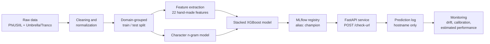
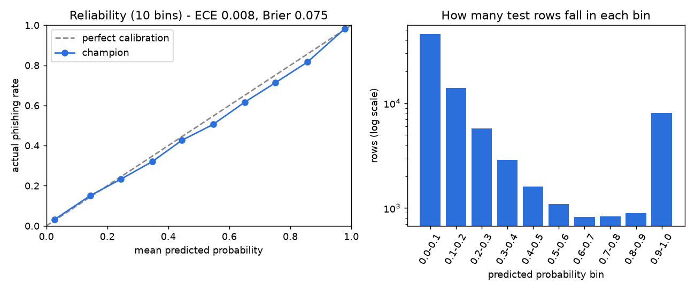
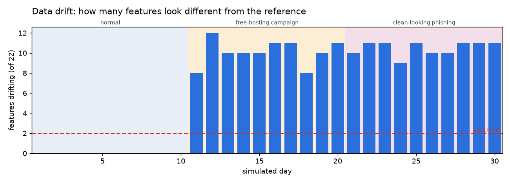
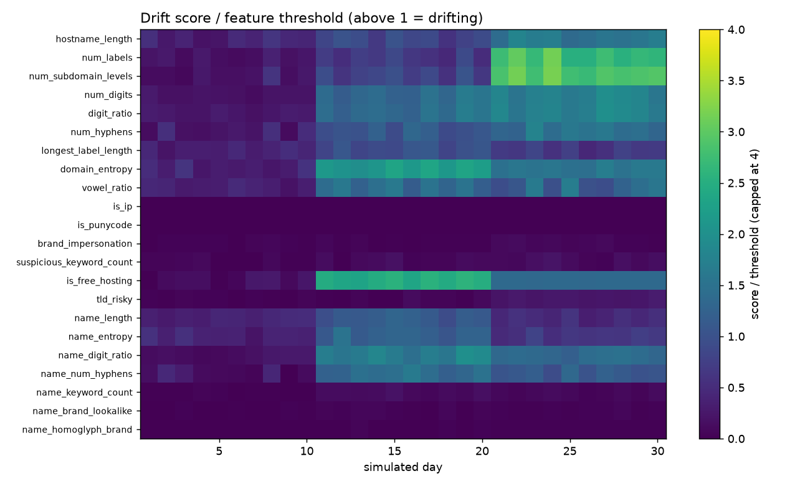
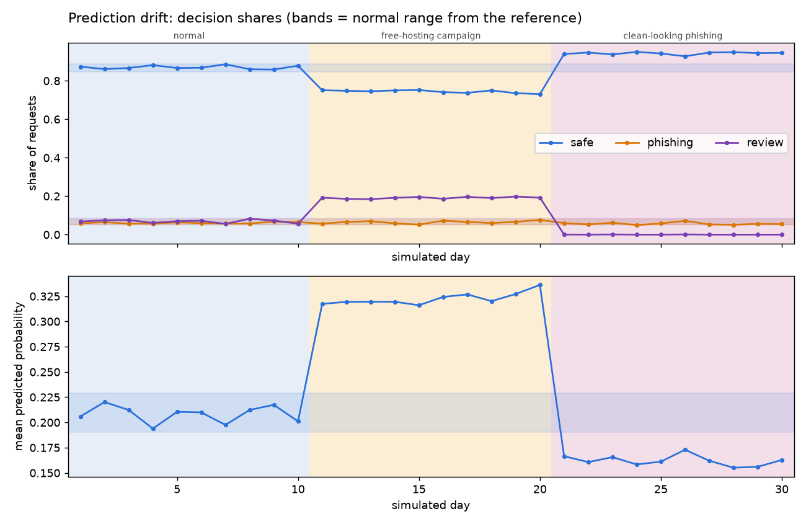
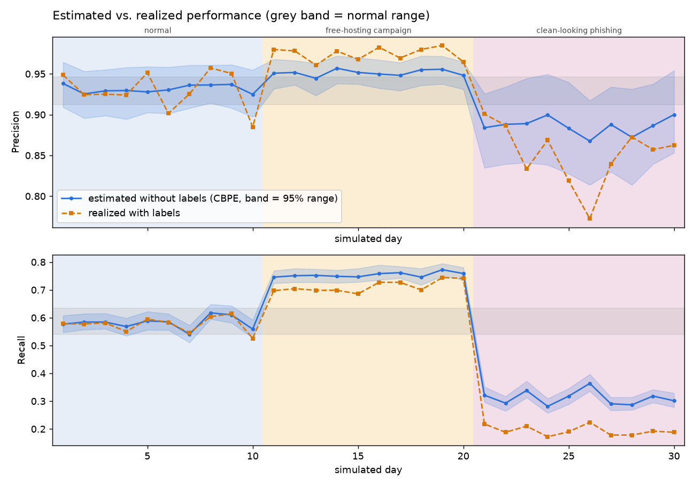

# Phishing URL Detector: Project Report

*Reading time: about 10 minutes. Technical terms are explained the first time they appear, and there is a glossary in section 11.*

> **Safety note.** This project only ever treats URLs and hostnames as **text**. Nothing was visited, fetched or looked up on the internet. Any real phishing hostname quoted below is "defanged" (dots written as `[.]`) so it cannot be clicked by accident.

---

## 1. Summary

This project builds a service that looks at a web address and says whether its **hostname** (the part like `mail.example.com`, without the page path) looks like **phishing**, meaning a fake site that tries to steal passwords or money. The final model is a "stacked" model that combines hand-written hostname clues with a text-pattern model. On a held-out test set it catches **57.4%** of phishing hostnames while wrongly flagging **1.18%** of legitimate ones, and 92.7% of its alerts are real phishing. It runs behind a small web API with a key, privacy-friendly logging, and a monitoring system that was tested on simulated traffic. The project's main lesson is that early scores were inflated by dataset shortcuts, and fixing them made the scores lower but more honest. The main limitation is that the model's recall depends heavily on one clue, "is hosted on a free hosting service": it catches 99.9% of such phishing but only 36.6% of phishing on ordinary domains, and it has not yet been tested on an independent dataset.

---

## 2. The problem

**Phishing** is a trick where an attacker builds a fake website that imitates a bank, a shop or an email login page, then sends people a link to it. Victims type their password or card number into the fake page.

Detecting it from the URL alone matters because it is fast and cheap: you can warn a user before the page loads, with no need to open the page (which is itself risky).

It is hard for three reasons:

- **Attackers adapt.** When defenders learn that "weird long names are suspicious", attackers switch to normal-looking names or to free hosting services. A model that learned yesterday's tricks slowly gets worse. This is called **drift** (the real world slowly changing away from the data the model learned from).
- **Mistakes are costly in both directions.** Missing a phishing site hurts a victim. Flagging a legitimate site (a **false positive**) annoys users and makes them ignore warnings.
- **Datasets are not the real world.** Collected datasets often contain accidental patterns that make the task look easier than it is. Most of this report is about finding and removing such patterns.

---

## 3. How the system works



- **Raw data:** two sources. PhiUSIIL is a public research dataset of phishing and legitimate URLs. Umbrella and Tranco are public popularity rankings of websites; they supplied extra legitimate hostnames (explained in section 5d).
- **Cleaning and normalization:** every URL is cut down to its hostname (lowercase, no `https://`, no path, no leading `www.`), and duplicates and contradictions are removed.
- **Domain-grouped split:** the data is divided into a training part and a test part so that no website owner ("registered domain", e.g. `example.com`) appears in both. See 5b.
- **Features:** a **feature** is one measurable clue given to the model, such as hostname length, number of digits, or whether the site is on a free hosting service. There are 22 hand-made ones.
- **Character n-gram model:** a second, simpler model that looks at short pieces of text. An **n-gram** is a run of n consecutive characters; here, runs of 3 to 5 characters. It learns patterns like `-verify` or `secur` without being told.
- **Stacked XGBoost:** the final model. **XGBoost** is a popular method that builds many small decision trees and combines their votes.
- **MLflow registry:** **MLflow** is a tool that records every training run (settings and scores). Its **model registry** stores the approved model under a name and an alias. Ours is `phishing-hostname-detector` with alias `champion`, so the API always loads "the current best".
- **FastAPI service:** **FastAPI** is a Python toolkit for web APIs. Our endpoint takes a URL, extracts the hostname, scores it and answers *safe*, *phishing* or *review*.
- **Prediction log:** each request is recorded (hostname, score, decision, time, request ID) for later analysis.
- **Monitoring:** scripts and a notebook that check whether live traffic and the model's behavior still look healthy.

---

## 4. The data

**Source.** The PhiUSIIL Phishing URL dataset (from the UCI Machine Learning Repository, dataset id 967) has **235,795** URLs: 134,850 legitimate (57.19%) and 100,945 phishing (42.81%).

**The label flip.** The original dataset marks legitimate URLs as `1` and phishing as `0`. That is the opposite of normal practice, where the "thing we want to detect" is `1`. The download script flips it, so in this project **1 = phishing and 0 = legitimate**. (A forgotten flip would silently reverse every result.)

**Cleaning steps and numbers** (from the `prepare_data` report; I regenerated it into a temporary folder and confirmed it reproduces the saved train and test files exactly):

| Step | Rows removed | Rows left |
|---|---:|---:|
| Raw rows | | 235,795 |
| Drop exact duplicate URLs | 425 | 235,370 |
| Drop empty hostnames | 0 | 235,370 |
| Drop duplicate (hostname, label) pairs | 16,218 | 219,152 |
| Drop hostnames that appear with *both* labels (58 hostnames) | 116 | 219,036 |
| Add filtered Umbrella legitimate hostnames (section 5d) | (+188,280) | 407,316 |
| Drop duplicates again after merging | 412 | 406,904 |
| Drop hostnames with both labels after merging | 0 | 406,904 |

The 16,218 duplicate pairs come from many different phishing URLs sharing one hostname once their paths are removed. The 58 contradictory hostnames were dropped because the same text cannot be both safe and phishing.

**Final sets** (split 80/20, no shared registered domains, verified zero overlap):

| Set | Rows | Phishing | Legitimate | % phishing | Distinct domains |
|---|---:|---:|---:|---:|---:|
| Train | 325,524 | 67,396 | 258,128 | 20.70% | 166,784 |
| Test | 81,380 | 16,848 | 64,532 | 20.70% | 41,730 |

Example phishing-labelled hostnames from the data, defanged: `kwan078lj[.]web[.]app`, `193-42-33-145[.]cprapid[.]com`, `jumptruegallery[.]000webhostapp[.]com`.

---

## 5. The story of the key findings

### 5a. The first shortcut: "has a path = phishing"

While exploring the raw URLs, I found that the two classes had been collected in completely different ways:

| | Legitimate | Phishing |
|---|---:|---:|
| Homepage-only URL (no path, query or fragment) | 100.0% | 71.6% |
| Starts with `https://` | 100.0% | 48.74% |
| Starts with `www.` | 100.0% | 41.4% |
| Ends with `/` | 0.0% | 36.5% |
| Average URL length (characters) | 27.2 | 46.2 |

Every legitimate URL was a bare `https://www.something` homepage. A **shortcut** is an accidental pattern that predicts the label in the dataset but has nothing to do with the real task. A model trained on whole URLs could score well by learning "has a path or no `www.` means phishing". That would collapse on real traffic, where legitimate URLs have paths all the time. (I did not train a whole-URL model to measure how high it would score: **not measured**.)

**The fix:** reduce every URL to its **hostname** only, with the scheme, `www.`, path, query and port removed and the text lowercased. This is "normalization". It removes the path, scheme and `www.` shortcuts by construction, at the price of discarding information that could help (see Next steps).

**Lesson:** if the two classes were collected differently, a model can learn the collection method instead of the problem. Look at the data before modelling.

### 5b. The domain-grouped split

Many hostnames belong to the same website owner. Of the phishing class, the 20 most frequent domains alone cover 30.8% of all phishing URLs (for example `web.app` and `firebaseapp.com`, which are free hosting services, account for 5.70% and 5.54%). With an ordinary random split, the same domain would land in both training and test, and the model could score well by simply **memorizing** domains it had already seen. That is **data leakage**: information from the test set leaking into training.

**The fix:** a **domain-grouped split** (using `StratifiedGroupKFold`). All hostnames of one registered domain go entirely to train or entirely to test, while the class balance stays the same. The same grouping is used inside cross-validation (5 folds), the process of repeatedly training on part of the training data and checking on the rest. The report verifies that **0** registered domains appear on both sides.

**Lesson:** a test set only measures generalization if it contains things the model has truly never seen.

### 5c. The stress test that exposed a second shortcut: "has a subdomain = phishing"

A **subdomain** is a label to the left of the main domain, as in `mail.` in `mail.example.com`. In the cleaned PhiUSIIL training data (version 1), only **2.87%** of legitimate hostnames had one, against **55.21%** of phishing hostnames. Another collection artifact.

To see whether the model had learned this, I hand-wrote a small **stress test set** of **83** well-known legitimate hostnames that all have subdomains (for example `mail.google.com`, `fr.wikipedia.org`). It is used only for measuring, never for training. It is hand-written and not verified against live sites. Results on version 1 of the data:

| Model (data v1) | Stress-test false-positive rate |
|---|---:|
| Logistic regression, all 15 features | 100% (83 of 83 flagged) |
| XGBoost, all 15 features | **84.34%** (70 of 83 flagged) |

The XGBoost model's feature importance (how much each clue is used) told the same story: `num_subdomain_levels` carried **69.9%** of the importance. Notice that this model looked good on the normal test set (PR-AUC 0.8617, explained in section 6) and was nearly useless on legitimate subdomains. Only the stress test showed it.

I also tried simply removing the subdomain and free-hosting features. On data version 1 it still flagged 67.47% of the stress set, so the problem was in the **data**, not just in two columns.

**Lesson:** a normal test score can look great while the model fails on a case that matters. Build a targeted stress test early.

### 5d. The data fix: Umbrella and Tranco hostnames

If legitimate subdomain hostnames are missing from the training data, the model cannot learn that they exist. I added **legitimate hostnames with subdomains** from the Cisco **Umbrella** top-1-million list (the most-visited domains seen by a DNS service), cross-checked against the **Tranco** list (a research-grade website popularity ranking). Both were downloaded as files on 2026-10-06; Tranco list id 56WKN. The filtering was strict:

| Filtering step | Removed | Remaining |
|---|---:|---:|
| Umbrella rows after normalization and de-duplication | | 953,741 |
| Drop no valid public suffix, or no subdomain | 207,615 | 746,126 |
| Drop registered domains not in the Tranco top 100,000 | 85,745 | 660,381 |
| Drop hostnames present in the PhiUSIIL *phishing* data | 84 | 660,297 |
| Drop registered domains used in the stress test | 9,680 | 650,617 |
| Cap at 20 hostnames per registered domain | 462,337 | 188,280 |

The stress-test domains (39 registered domains) are removed on purpose so the stress test stays a fair exam and not something the model has seen. The cap of 20 per domain stops a few huge sites from dominating. After merging and de-duplicating, 187,868 Umbrella hostnames remained in the data.

**Result, with the same features and the same XGBoost settings:** the stress-test false-positive rate fell from **84.34% to 13.25%** (from 70 flagged hostnames to 11).

**Lesson:** when a model shows a shortcut, fix the data that taught it, not just the model.

### 5e. Why the scores dropped, and why that is more honest

After the fix, the headline scores of the same XGBoost model went *down*:

| XGBoost, 15 features | Data v1 | Data v2 (with Umbrella) |
|---|---:|---:|
| PR-AUC (test) | 0.8617 | 0.7121 |
| ROC-AUC (test) | 0.8587 | 0.8383 |
| Precision at threshold 0.5 | 0.9318 | 0.8756 |
| Recall at threshold 0.5 | 0.6301 | 0.4542 |
| Stress-test false-positive rate | 84.34% | 13.25% |

Why this is a better result and not a worse one: the old scores were partly earned by the "subdomain = phishing" shortcut. The new task is harder and closer to reality, because legitimate hostnames now include realistic subdomains.

**PR-AUC is not comparable across the two data versions.** PR-AUC (average precision, a single number summarizing the trade-off between precision and recall across all thresholds) depends on how common phishing is in the data. A model guessing at random scores about the share of positives: **38.46%** phishing in the v1 test set versus **20.70%** in the v2 test set. Comparing 0.86 to 0.71 therefore mixes "worse model" with "different mix of data". ROC-AUC, which does not depend on the phishing share in the same way, fell less (0.8587 to 0.8383). The reliable comparison is the stress test: 84.34% down to 13.25%.

**Lesson:** a lower score on a harder, fairer test is progress. Never compare a metric across datasets without checking that the class balance is the same.

### 5f. The stacked model

**Stacking, by analogy.** Imagine two advisers. One is a detective with a checklist (the hand-made features: "is it on free hosting?", "does it contain digits?"). The other has read thousands of examples and has a feel for what suspicious names *look like* (the n-gram model). Instead of choosing one, you hire a **manager** (the final XGBoost) who reads both opinions and makes the call. To keep the manager honest, the n-gram opinion it learns from is always from a model that has not seen that particular row (an "out-of-fold" opinion).

Results on the test set, all at the threshold chosen to give about a 1% false-positive rate (section 6):

| Model | PR-AUC | ROC-AUC | Precision | Recall | False-positive rate |
|---|---:|---:|---:|---:|---:|
| XGBoost, 15 original features | 0.7121 | 0.8383 | 0.9049 | 0.4342 | 1.19% |
| XGBoost, 22 features (7 new name features) | 0.7182 | 0.8425 | 0.9124 | 0.4436 | 1.11% |
| Character n-gram model alone | 0.7805 | 0.9063 | 0.8978 | 0.4174 | 1.24% |
| **Stacked (final)** | **0.8285** | **0.9186** | **0.9269** | **0.5738** | **1.18%** |

At about the same false-alarm rate, recall rose from 0.4436 (22 features alone) to **0.5738**. In plain words, the stacked model catches about 13 more phishing hostnames per 100 phishing hostnames than the feature-only model, without more false alarms. One honest caveat: on the stress test the stacked model flagged **14.46%** (12 of 83), slightly worse than the feature-only model's 13.25%.

**Lesson:** two different views of the same hostname complement each other.

### 5g. The remaining weakness: free hosting, and the "review" decision

A **free hosting service** (e.g. `github.io`, `web.app`, `netlify.app`) lets anyone publish a site under a shared domain. Attackers love them, but so do students and developers. In the training data free hosting is lopsided: it covers 20.41% of phishing but 0.05% of legitimate hostnames (only 120 legitimate rows among 13,877 free-hosting rows). The model learned a strong rule, "free hosting = phishing". It is by far the model's most important clue (73.7% of the importance in the stacked model).

The stress test shows the consequence. Of the 12 legitimate hostnames the stacked model flagged, 11 are well-known legitimate projects hosted on `github.io` (for example `microsoft.github.io` and `google.github.io`) and the 12th is `docs.github.com`. The stress set contains 11 `github.io` names, and the model flagged all 11 of them.

**The response is a third decision.** When the model's score is above the threshold *and* the hostname is on a known free-hosting service, the API answers **"review"** ("a human should look; this is ambiguous") instead of "phishing". On the test set the final decisions are: safe 70,951, review 5,544, phishing 4,885 (derived by applying the API rule to the test predictions).

**Lesson:** when a model cannot tell two cases apart, the honest design is to say "I am not sure" and route it to review.

---

## 6. Final model results

The final model is the stacked model, registered in MLflow as `phishing-hostname-detector`, alias `champion`, version 1. It was **not** tuned on the test set: the decision **threshold** (the score above which we call something phishing) was chosen on out-of-fold predictions for the training data so that only 1% of legitimate hostnames would be flagged, giving a threshold of **0.626**. All numbers below are on the held-out test set of 81,380 hostnames.

| Metric | Value | What it means in plain English |
|---|---:|---|
| PR-AUC | 0.8285 | How well the model ranks phishing above legitimate across all thresholds, with extra weight on precision for the rarer class. |
| ROC-AUC | 0.9186 | The chance that a random phishing hostname gets a higher score than a random legitimate one. |
| Threshold | 0.626 | The score at which we raise an alert. |
| Precision | 0.9269 | Of everything flagged, the share that really is phishing. |
| Recall | 0.5738 | Of all real phishing, the share we caught. |
| False-positive rate | 0.0118 (1.18%) | Of all legitimate hostnames, the share wrongly flagged. |
| F1 score | 0.7088 | A single number that balances precision and recall. |
| Stress-test false-positive rate | 0.1446 (14.46%, 12 of 83) | Legitimate subdomain hostnames wrongly flagged. |

**Counts behind these numbers** (test set): 9,667 phishing caught, 762 false alarms, 7,181 phishing missed, 63,770 legitimate correctly passed.

**Why accuracy alone is misleading.** In the test set 79.30% of hostnames (64,532 of 81,380) are legitimate. A "model" that always answers *safe* would therefore be **79.30% accurate while catching zero phishing**. Our model's accuracy at the chosen threshold is 90.24%, which looks good but hides the fact that it **misses 42.6% of phishing** (recall 0.5738). That is why this report quotes precision, recall and false-positive rate instead.

**The threshold is a choice, not a fact.** At the standard 0.5 threshold the stacked model has recall 0.6138 but a false-positive rate of 2.18% (precision 0.8804). We chose the stricter threshold because false alarms are what make users stop trusting a warning.

---

## 7. The API

**What it does.** `POST /check-url` takes a URL, normalizes it to a hostname, scores that hostname with the champion model, and returns a decision. `GET /health` reports the model name and version. The service never opens, fetches or looks up the URL.

**Example** (the URL below is **made up** for illustration; the response is the real output of the running service for that input):

Request:
```json
{ "url": "https://paypa1-verify.github.io/login?next=/account" }
```

Response:
```json
{
  "hostname": "paypa1-verify.github.io",
  "decision": "review",
  "probability": 0.9995,
  "threshold": 0.626,
  "signals": ["free hosting", "brand lookalike", "brand homoglyph", "suspicious keywords"],
  "model_version": "1"
}
```

Note that the path and query (`/login?next=...`) are discarded, and `signals` lists the human-readable clues that fired. For comparison, the real service rated the made-up input `https://mail.google.com/mail/u/0/` as **safe** (probability 0.0808).

**The three decisions**

| Decision | When |
|---|---|
| **safe** | The score is below the threshold (0.626). |
| **phishing** | The score is at or above the threshold and the hostname is not on free hosting. |
| **review** | The score is at or above the threshold but the hostname is on free hosting, where the model cannot reliably separate attackers from legitimate users. |

**Security.** Every call to `/check-url` must carry an `X-API-Key` header; wrong or missing keys get a 401 error. The key is kept in a local `.env` file that is excluded from Git, and the server refuses to start with the placeholder key. Inputs are validated (length limits, a hostname must be extractable). 55 automated tests pass, covering the API, feature extraction and normalization.

**Privacy.** The log stores only the **hostname**, never the full URL, because paths and query strings can contain tokens or personal data. Each log line holds: request ID, timestamp, hostname, probability, decision and model version. The request ID is also returned in an `X-Request-ID` header so predictions can later be matched with true labels. The log file location is configurable (`LOG_PATH`).

---

## 8. Monitoring

> **Everything in this section uses simulated traffic.** No real users or real traffic were involved. The "traffic" is hostnames sampled from the held-out test set and sent through the real API in code. The scenarios were designed by me, so the results show that the checks *work in controlled conditions*, not how real attackers would behave.

### Calibration: can we trust the probabilities?

A model is **calibrated** if its probabilities mean what they say: among hostnames scored about 0.30, roughly 30% should really be phishing. This matters because label-free performance estimation (below) relies on it.

| Measure | Value |
|---|---:|
| Brier score (average squared error of the probabilities; lower is better) | 0.0751 |
| Brier score of always predicting the base rate | 0.1642 |
| Expected calibration error (average gap between predicted and actual rates) | 0.0081 |

Verdict: **the probabilities are reasonably trustworthy** (limit used: 0.02). The model is mildly overconfident in the middle range: for scores between 0.3 and 0.9 it predicts about 3 to 4 percentage points more phishing than actually occurs. The two ends, where most rows sit, are accurate: the 0.0-0.1 bin (45,413 rows) is off by 0.0049 and the 0.9-1.0 bin (8,101 rows) by 0.0037.



*How to read it: the dashed diagonal is perfect calibration; the blue line is our model. The closer they are, the more the model's probabilities can be trusted.*

### The simulation

30 simulated days, 2,000 requests per day (60,000 in total), with labels stored separately as if they arrived later. The **reference** (what "normal" looks like) is a random 20% holdout of the test set (16,276 rows, 20.7% phishing) that the simulation never used.

| Days | Scenario | How it was built |
|---|---|---|
| 1 to 10 | **Normal** | Random sample with the test set's natural mix (about 21% phishing). |
| 11 to 20 | **Free-hosting campaign** | 35% phishing; most of the extra phishing comes from free-hosting hostnames. |
| 21 to 30 | **Clean-looking phishing** | 25% phishing, taken *only* from phishing hostnames with no subdomain, no digits, no hyphens, a non-risky TLD (the ending such as `.com`) and no free hosting. |

### The checks

- **Data drift:** for each of the 22 features, compare the day's distribution with the reference. A feature "drifts" when its score exceeds a threshold learned from normal day-to-day noise. An alert fires when more than 2 features drift.
- **Prediction drift:** the share of *safe*, *phishing* and *review* decisions and the average probability.
- **Estimated performance without labels (CBPE):** *Confidence-Based Performance Estimation*. If the probabilities are calibrated, a score of 0.9 counts as "0.9 of a true phishing hit and 0.1 of a false alarm". Adding these up over a day gives expected precision and recall with no labels at all. (I implemented it directly with NumPy; installing the NannyML library would have added about 40 extra packages and its tested versions predate the pandas version used here.)
- **Realized performance with labels:** the real precision and recall once the labels are joined.
- **Alerts:** raised when a daily value leaves the reference mean ± 3 standard deviations (computed from 200 random day-sized slices of the reference).

### What each scenario showed

Daily values averaged per scenario:

| | Days 1-10 normal | Days 11-20 free hosting | Days 21-30 clean-looking |
|---|---:|---:|---:|
| True phishing share | 20.98% | 35.00% | 25.00% |
| Features drifting (per day) | 0 | 8 to 12 | 9 to 11 |
| Share "safe" | 87.00% | 74.42% | 94.29% |
| Share "review" | 6.90% | 19.14% | 0.02% |
| Mean probability | 0.208 | 0.323 | 0.162 |
| Estimated precision | 0.932 | 0.951 | 0.886 |
| **Realized precision** | 0.929 | 0.975 | 0.851 |
| Estimated recall | 0.581 | 0.754 | 0.311 |
| **Realized recall** | 0.575 | 0.712 | 0.194 |
| Alerts raised | 1 | 78 | 76 |

- **Days 1-10:** quiet. No drift and no meaningful alert (one marginal false alarm on day 7: estimated recall 0.5404 against a limit of 0.5410). Estimated and realized performance agree closely.
- **Days 11-20:** loud on both data and predictions. Free-hosting features, digit and entropy features jumped, and the "review" share nearly tripled. Performance actually *rose* (realized recall 0.712), because free-hosting phishing is exactly what the model catches best. The alerts mean "something changed", not "the model got worse".
- **Days 21-30:** every check fires. The share of "safe" answers rises, "review" almost disappears, and realized recall collapses to 0.194. Part of the drift signal is an artifact of how the scenario was built: removing all phishing that has subdomains, digits, hyphens or free hosting changes the whole mix of incoming hostnames.



*Each bar counts how many of the 22 features look different from the reference that day. The dashed line is the alert limit of 2.*



*Brighter means a stronger change. A value above 1 means that feature is "drifting". It shows which clues moved, not just that something moved.*



*The shaded bands are the normal range from the reference. The change in "review" and "safe" shares is visible on the day each scenario starts, with no labels needed.*

### Did estimated performance track realized performance?



*Blue is the label-free estimate (with a 95% range); orange is the real value computed afterwards from labels. Where they overlap, the estimate can be trusted.*

| Scenario | Average gap in recall (estimate vs. real) | Average gap in precision |
|---|---:|---:|
| Days 1-10 | 0.0093 | 0.0158 |
| Days 11-20 | 0.0418 | 0.0233 |
| Days 21-30 | 0.1174 | 0.0380 |

**Yes in normal conditions, partly under a campaign, and only as a warning under real concept change.** On normal days the estimate was within about one percentage point on recall. In the free-hosting campaign it followed the direction but overstated recall by about 4 points. In the clean-looking scenario it correctly saw a big drop (estimated recall 0.311, down from 0.581) but **understated it**: the real recall was 0.194. The model is confident in its mistakes on exactly this kind of hostname, so its own probabilities cannot fully reveal how wrong it is.

**Main lesson:** monitoring without labels can reliably tell you *that* something changed and roughly *which way* performance moved, but only labels tell you *how bad* it is. Plan a way to collect real labels (for example, analyst reviews) and use them to confirm alerts.

---

## 9. Limitations

- **Hostname-only.** Version 1 sees only the hostname. A phishing page on a legitimate-looking domain with a malicious path (`good-site.com/fake-login`) looks identical to the real site. Path, query and page content are ignored.
- **Free hosting dominates the result.** In the test set, 5,550 hostnames are on free hosting and 5,530 of them are phishing (99.6%), so the model learned "free hosting = phishing". Its recall is **99.9%** on free-hosting phishing but only **36.6%** on phishing hosted on ordinary domains. Of the 9,667 phishing hostnames it catches, 5,526 are on free hosting. The headline recall of 0.5738 therefore overstates how well it finds *non-free-hosting* phishing. Real legitimate users of free hosting (the `github.io` stress cases) are flagged, which is why the "review" decision exists.
- **The source shortcut remains.** The legitimate data now comes from two sources: PhiUSIIL (mostly bare domains) and Umbrella (selected for having subdomains). So "has a subdomain" is now partly a clue about *which list a legitimate hostname came from*. The stacked model gives PhiUSIIL legitimate rows a higher average score than Umbrella ones (0.1505 versus 0.0508), which suggests the source still influences it, although at the chosen threshold the false-positive rates are close (1.29% versus 1.10%). How much this inflates the results is **not measured**.
- **Hand-written lists.** The brand names, suspicious keywords, free-hosting services and risky TLDs are lists I wrote by hand. They are incomplete and will age as attackers change tactics.
- **Small, hand-written stress set.** It has 83 hostnames, written by hand and not verified against live sites. 11 of them are `github.io` names, so the set is dominated by one kind of failure.
- **No independent evaluation yet.** All scores come from one dataset (plus Umbrella legitimate rows), split in code. The model has not been tested on a separate, independently collected phishing dataset, so real-world performance is **not measured**.
- **Simulated traffic.** The monitoring evidence comes from synthetic scenarios I designed. The simulated days draw from the same test set the model was evaluated on, which means they cannot show how the model behaves on genuinely new attacker behavior.
- **Calibration is mild but not perfect.** The probabilities are overconfident by 3 to 4 points in the mid range, and label-free estimates inherit that bias.
- **Moderate fold-to-fold variation.** Cross-validated PR-AUC for the stacked model is 0.79 with a standard deviation of 0.0356 across folds, so a single score hides a real spread.
- **Recall is modest.** At the 1% false-positive setting the model misses 42.6% of phishing (7,181 of 16,848 test hostnames).

---

## 10. Next steps

1. **SHAP explanations:** a method that shows how much each clue pushed one specific prediction up or down, so each alert can say *why*.
2. **CI/CD:** automatic testing and checks on every code change (continuous integration), and automatic delivery of passing changes (continuous delivery).
3. **Docker:** package the service and its dependencies in a container so it runs the same everywhere.
4. **A demo web page:** a simple page where anyone can paste a URL and see the result.
5. **An independent evaluation dataset:** test on phishing and legitimate data collected by someone else, ideally from a different time period.
6. **Full-URL features (v2):** use path, query and other parts of the URL, while handling the collection-shortcut problem from section 5a.
7. **External signals (v3):** domain age, certificate details and similar information (this would need network lookups, which this project deliberately does not do yet).
8. **Collect real labels** from user feedback or analyst review to confirm monitoring alerts.

---

## 11. Glossary

| Term | Plain definition |
|---|---|
| **Phishing** | A fake website designed to trick people into giving away passwords or money. |
| **Hostname** | The address part naming a site, such as `mail.example.com`, without the page path. |
| **Subdomain** | A label placed in front of a domain, like `mail` in `mail.example.com`. |
| **Registered domain** | The part an owner actually registers, such as `example.com`. |
| **Feature** | One measurable clue about an example that is given to the model. |
| **Label** | The correct answer for an example; here 1 = phishing, 0 = legitimate. |
| **Data leakage** | When information from the test data sneaks into training, making scores look better than they are. |
| **Shortcut** | An accidental pattern in the data that predicts the label but has nothing to do with the real task. |
| **Precision** | Of the items flagged as phishing, the share that really are. |
| **Recall** | Of all real phishing, the share the model catches. |
| **False positive** | A legitimate item wrongly flagged as phishing. |
| **False-positive rate** | The share of legitimate items that are wrongly flagged. |
| **Threshold** | The score above which the system raises an alert. |
| **PR-AUC** | One number summarizing the trade-off between precision and recall across all thresholds; it depends on how common phishing is in the data. |
| **ROC-AUC** | The chance that a random phishing item scores higher than a random legitimate one. |
| **Cross-validation** | Repeatedly training on part of the training data and checking on the rest to estimate how well a model generalizes. |
| **Stacking** | Combining several models by feeding their outputs into a final model that makes the decision. |
| **N-gram** | A run of n consecutive characters (or words) used as a pattern. |
| **Drift** | When live data or behavior slowly moves away from what the model was trained on. |
| **Calibration** | Whether a model's probabilities match reality (a 0.3 score is phishing about 30% of the time). |
| **Brier score** | The average squared error of predicted probabilities; lower is better. |
| **CBPE** | Confidence-Based Performance Estimation: estimating precision and recall without labels by trusting the model's calibrated probabilities. |
| **Model registry** | A catalogue of trained models with names, versions and aliases such as "champion". |
| **Stress test** | A small, targeted set of hard cases used to check a known weak spot. |

---

## 12. Tech stack

- **Python** with **pandas** and **NumPy**: data cleaning and calculations.
- **tldextract** (offline mode): splitting hostnames into subdomain, domain and suffix.
- **RapidFuzz**: finding brand look-alikes (names a couple of letters away from a known brand).
- **scikit-learn**: grouped cross-validation, the character n-gram model and metrics.
- **XGBoost**: the main tree-based model and the final stacked model.
- **MLflow** (SQLite storage): experiment tracking and the model registry.
- **FastAPI**, **Uvicorn**, **Pydantic**, **python-dotenv**: the web API, input validation and local secrets.
- **pytest** and **httpx / FastAPI TestClient**: 55 automated tests and traffic simulation through the real API.
- **SciPy** (Kolmogorov-Smirnov test) and **Matplotlib**: drift scores and charts.
- **Jupyter**: the exploration, feature-audit and monitoring notebooks.
- **ucimlrepo**: downloading the PhiUSIIL dataset.
- **Git**: version control.
